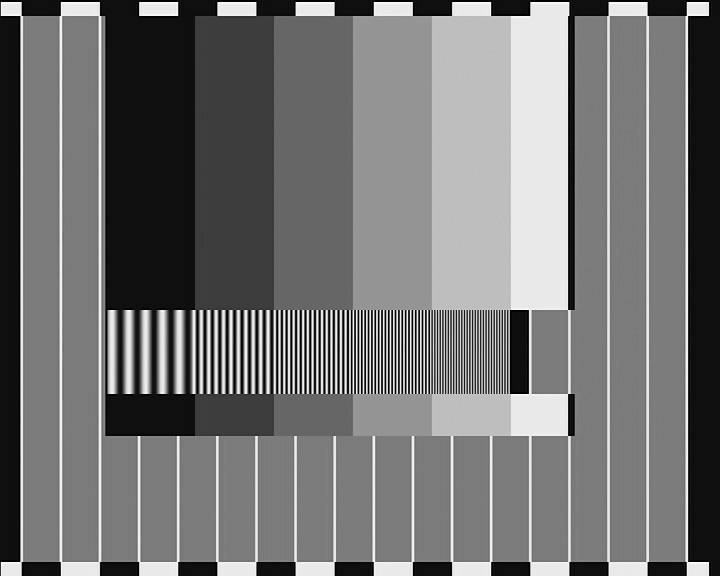
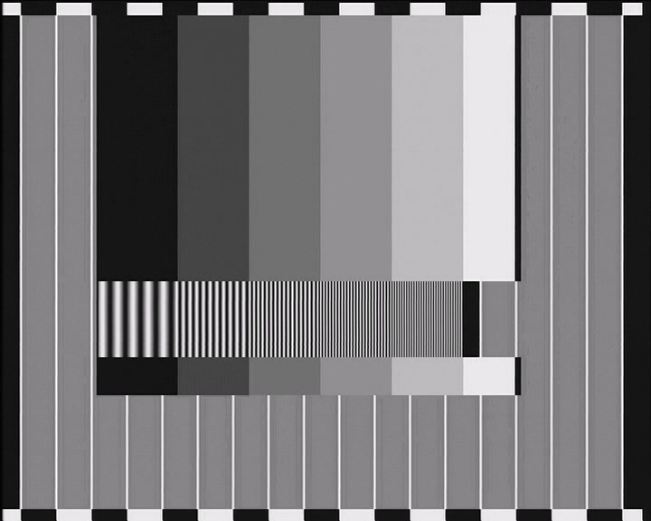
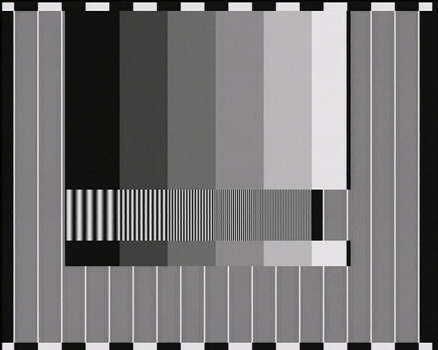
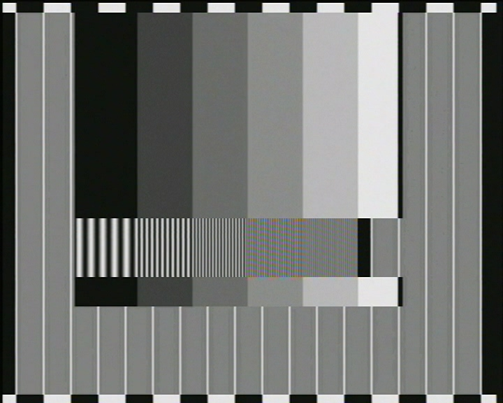

### Non scientific visual resolution test of DataVideo TBC-7000

**REF - reference digital image**

**LOOPBACK - Blackmagic Intensity Pro (Y/C out) -> JVC GR-D53E**

**YC - Blackmagic Intensity Pro (Y/C out) -> DataVideo TBC-7000 (Y/C in) -> JVC GR-D53E**

**CVBS - Blackmagic Intensity Pro (CVBS out) -> DataVideo TBC-7000 (CVBS in) -> JVC GR-D53E**

## REF 

## LOOPBACK

## YC

## CVBS

Hardware used: 
* Blackmagic Intensity Pro
* DataVideo TBC-7000 (Y/C output)
* JVC GR-D53E (Y/C input, FireWire output)

Software used:
* Davinci Resolve (output)
* Scenalyzer Live (DV capture)

