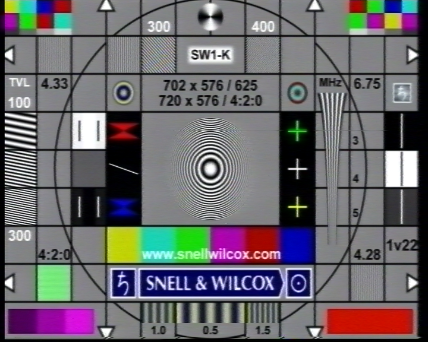
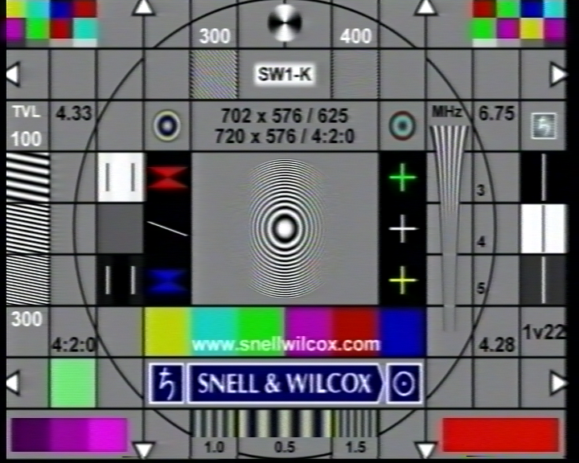
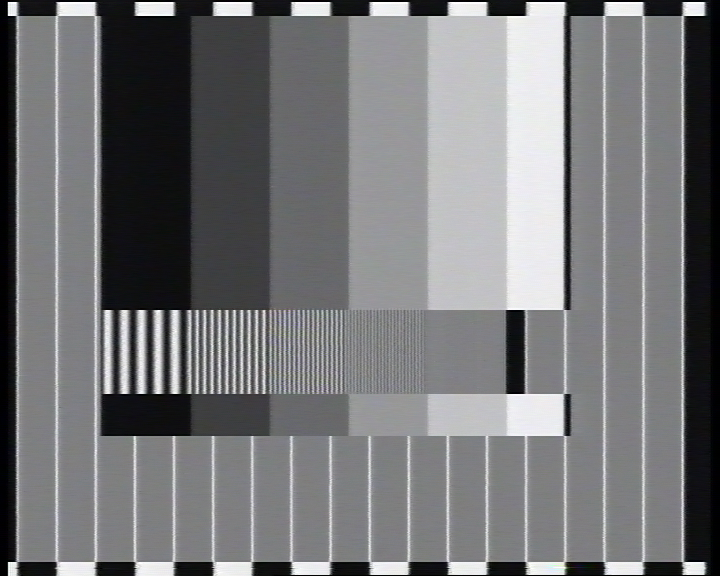
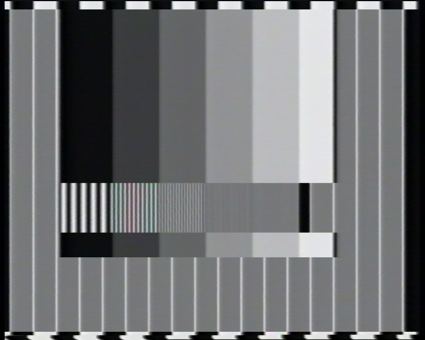

# JVC HR-S7700EU VHS vs S-VHS recoding test

* **DNR/TBC** ON
* **S-VHS ET** recording
* **B.E.S.T** OFF

* **SW** - Snell&Wilcox test chart
* **RES+COL** - resolution + color chart
* **RES** - pure B/W resolution test chart

### JVC HR-S7700EU -> Blackmagic Intensity Pro (Y/C)

## SW

### S-VHS ET

### VHS

## RES+COL

### S-VHS ET

### VHS

## RES

### S-VHS ET

### VHS

