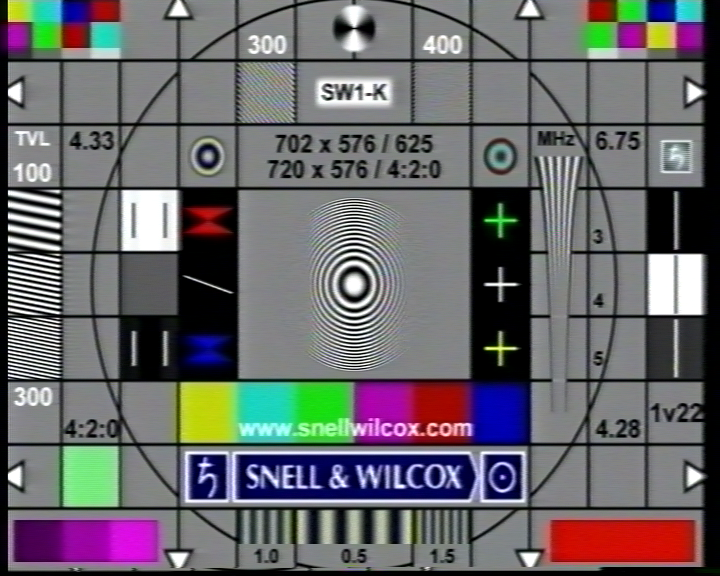

# JVC HR-S7700EU general picture quality test

Test tape was recorded with **BM Intensity Pro -> JVC HR-S7700EU (Y/C)** from Davinci Resolve, it contains:
* **SW** - Snell&Wilcox test chart
* **RES+COL** - resolution + color chart
* **RES** - pure B/W resolution test chart

> [!NOTE]
> Following screenshots were taken from BM Media Express. This is a straight capture, so ignore some color artifacts

### TL;DR: poor frequency response (losing details) in comparison with _VHS-only_ VCRs

* **TBC/NR** - on
* **3R NR**  - off
* **EDIT** mode

### JVC HR-S7700EU -> Blackmagic Intensity Pro (Y/C)

### SW

### RES+COL

### RES

