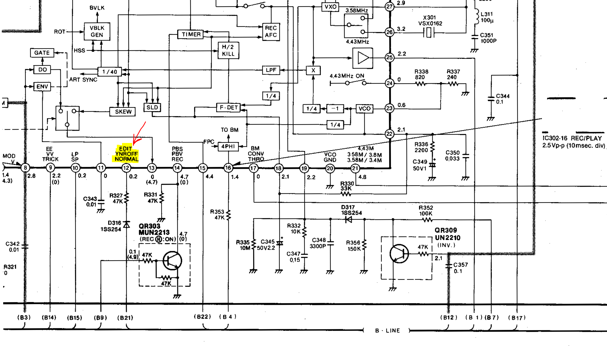
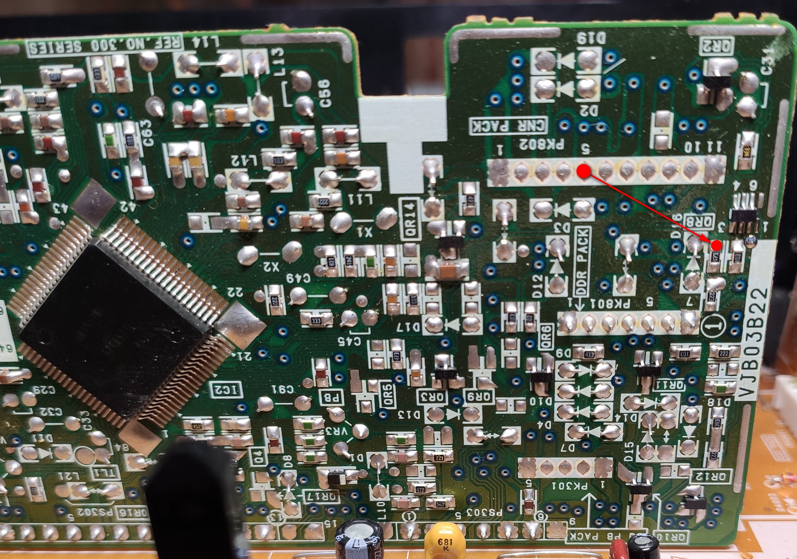
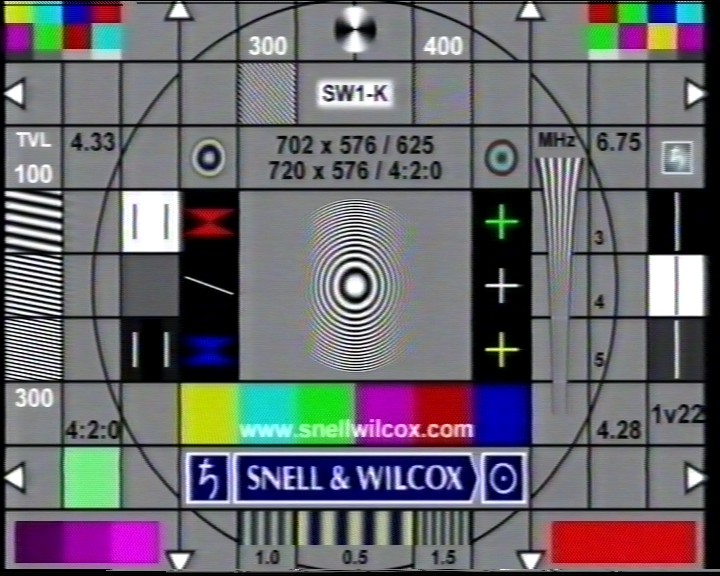
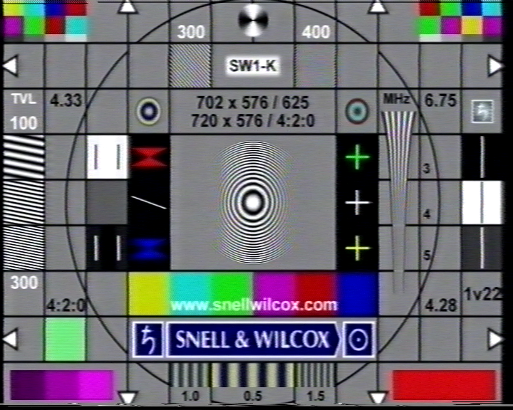

# Panasonic NV-SD400 EDIT mod

### This mod enables EDIT mode on Panasonic 300/350/400/450 series (maybe on even more models)

### Mod description

You need to set `pin 12` of the color processor to `HIGH`. This will enable `EDIT` mode on a hardware level.

A processor is located on `LUMINANCE & CHROMINANCE PACK` board.

This is a part of a schematic for `SD300/400` that shows pin 12 as `EDIT/YNROFF/NORMAL`.

This photo shows 2 points that you need to connect. First one is `+5V` and second is `R327`

> [!CAUTION]
> Always use a pull-up resistor to limit the current! Do not short pins!

EDIT mode has less noise reduction and gives you a better picture in general. 

Following screenshots were taken from BM Media Express. This is a straight capture, so ignore color artifacts

**Panasonic NV-SD400 -> BM Intensity Pro (CVBS)**

### NORMAL mode

### EDIT mode

