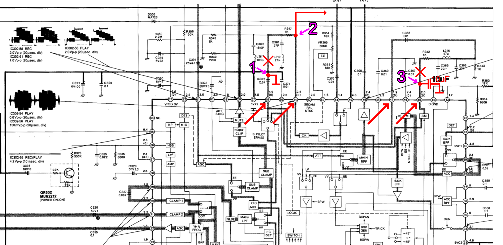
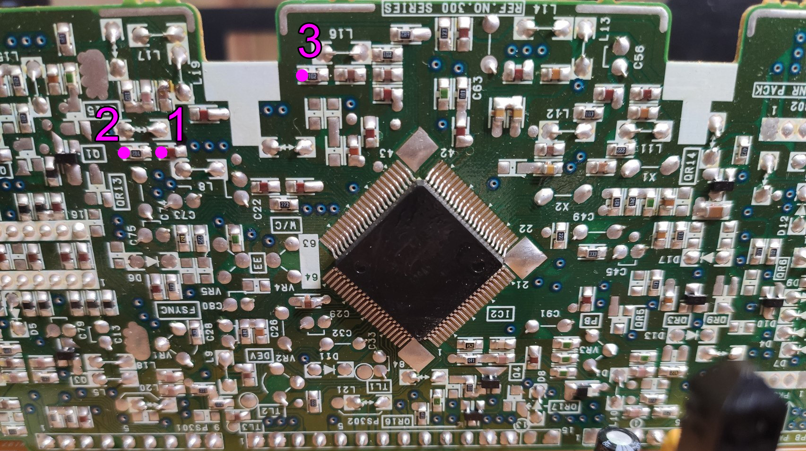
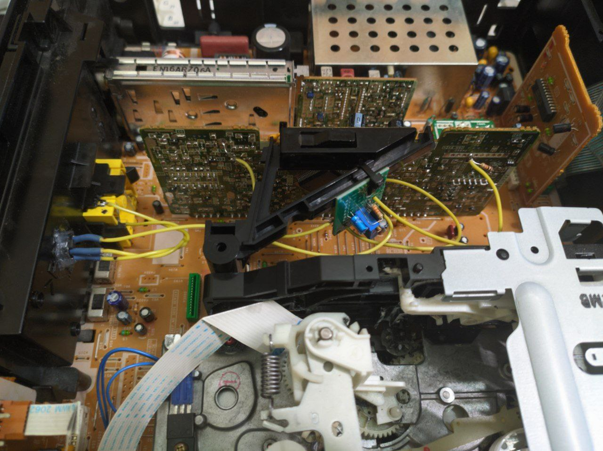
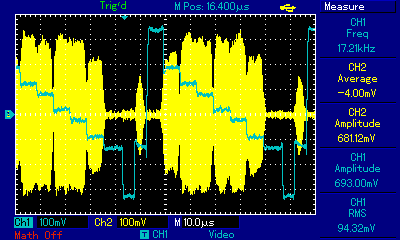
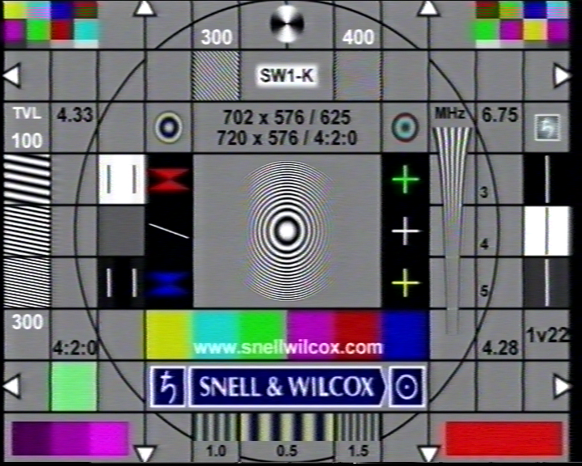
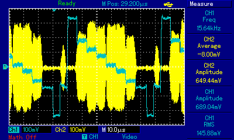
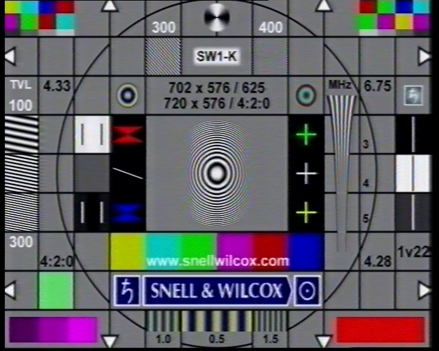
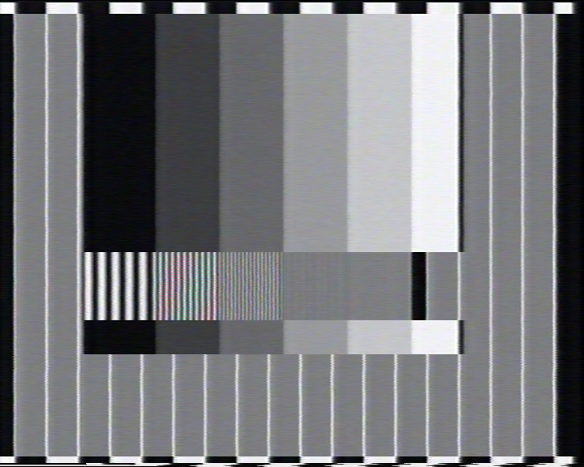

# Panasonic NV-SD400EU Y/C mod

### This mod allows Y/C output on european Panasonic SD300/400 series (on all models with this video processor chip _in theory_)

> [!WARNING]  
> This mod was tested only on PAL recordings. SECAM/NTSC quasi p.b. results are unknown

## Circuit modification

You need to **intercept chroma signal before entering Y/C mixer**. This will make CVBS output only luma during playback.

This mod slightly extends SD400's frequency response as shown in a comparison part.

This is a part of **LUMINANCE & CHROMINANCE PACK SCHEMATIC DIAGRAM** we are interested in:

We need to block all paths for chroma signal to Y/C mixer (otherwise we'll have chroma leakage). In order for this to work, you need to:
1. **Disconnect _C372_ from _R347_** (by simply removing/moving _R374_ to the side)
2. **Connect _C372_ to ground**
3. **Break connection between _Pin 45_ and _R342_** (_Pin 47_ will be grounded this way)
4. **Connect _Pin 45_ to ground with a capacitor** (I used 10uF ceramic)

This way you should eliminate all chroma paths to _S PILOT ERASE_ block.

Below is a photo of SD400EU board with 3 points shown. However, it's better to double-check before proceeding with modding your unit.

## Building video buffer

SD400's chroma signal, _per manual_, has an amplitude of ~0.6Vp-p (slightly more in my case). For impedance matching I used a simple 2N5089 based video buffer. 

A 17k resistor has approximate value (I used a 50k pot instead) and is used to set the base voltage.

This is how final result looks in my SD400EU:

## Checking the final result

Observe Y and C waveforms during EBU colour bars playback. Pay attention to the level of _fuzziness_ on Y channel.

### ✅ Correct Y/C implementation

Small amount of noise is present on Y signal, bars' "steps" are clearly visible.

Note the lack of artifacts on color boxes.

### ❌ Incorrect Y/C implementation

Y channel "steps" are fuzzy (ignore different chroma level) apart from pure white. This means that chroma is being superimposed on luma channel as in CVBS (composite).

Color boxes clearly have _checkerboard pattern_ on them.

### Possible fixes

To deal with chroma leakage you can:
* **Disconnect _C channel_ ground** (Y and C channels will share one Y channel's ground)
* **Use different buffer design** (I had issues with more complex video buffer, so I switched to this simpler one)

## CVBS vs Y/C comparison

### Panasonic NV-SD400EU (EDIT) -> Blackmagic Intensity Pro (CVBS | Y/C)

> [!NOTE]
> Following screenshots were taken from BM Media Express. This is a straight capture, so ignore some color artifacts with composite input

### CVBS

### Y/C!

### CVBS

### Y/C

### CVBS

### Y/C

