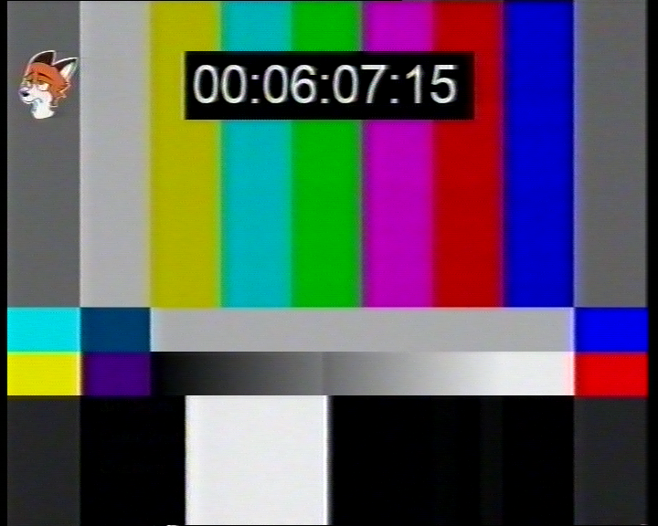
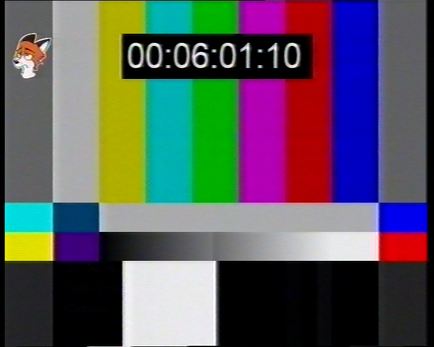

# Panasonic NV-SD400EU head drum assy replacement

### Old head drum: ~1500-2000 running hours

### New head drum: <500 running hours (most likely even less)

### Panasonic NV-SD400EU -> Panasonic DMR ES-15 -> Blackmagic Intensity Pro (YC)

### TL;DR: marginal differences

### OLD

### NEW

