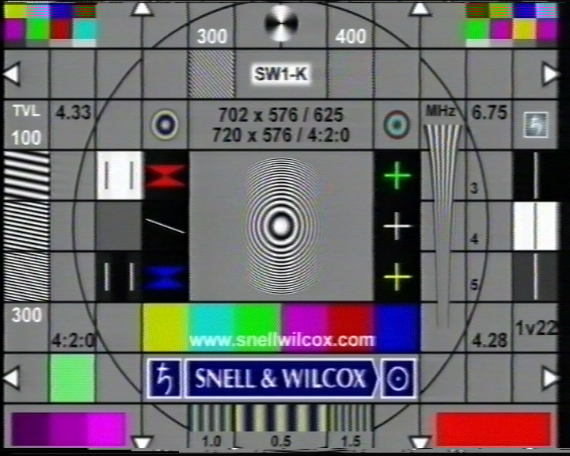
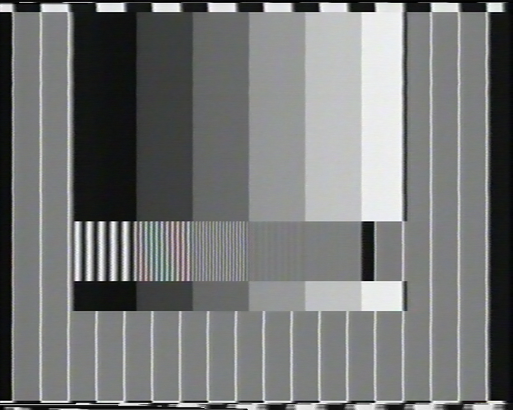

# Panasonic NV-SR55EU general picture quality test

Test tape was recorded with **BM Intensity Pro -> JVC HR-S7700EU (Y/C)** from Davinci Resolve, it contains:
* **SW** - Snell&Wilcox test chart
* **RES+COL** - resolution + color chart
* **RES** - pure B/W resolution test chart

> [!NOTE]
> Following screenshots were taken from BM Media Express. This is a straight capture, so ignore some color artifacts

### TL;DR: not bad overall, but line stability is mediocre at best

### Panasonic NV-SR55EU -> Blackmagic Intensity Pro (CVBS)

### SW

### RES+COL

### RES

