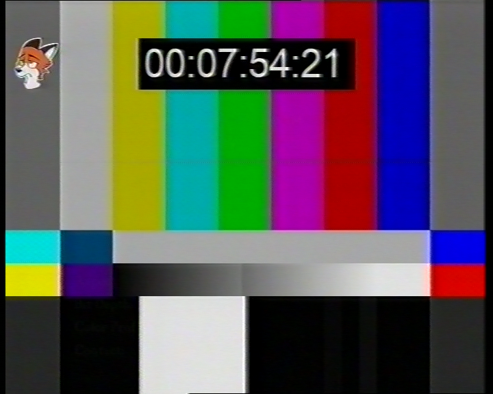
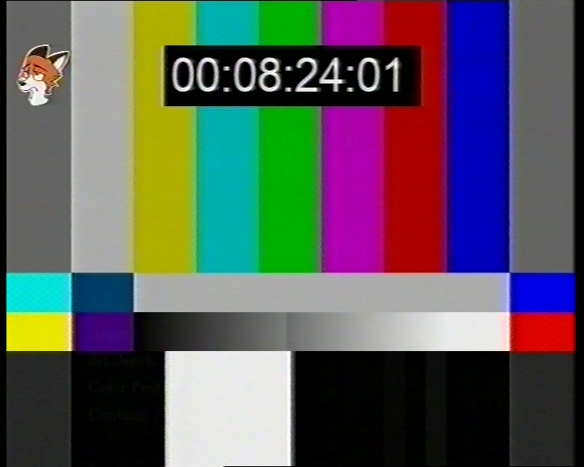

# Phillips VR888 picture modes test

### Phillips VR888 -> Panasonic DMR ES-15 -> Blackmagic Intensity Pro (YC)

### TL;DR:

* **NORMAL** - regular picture, though not colour accurate
* **ENHANCED** - noise reduction, not impressive, greatly softens the image
* **INCREDIBLE** - added sharpness, suitable for TV captures or poorly recorded tapes

## NORMAL

## ENHANCED

## INCREDIBLE

