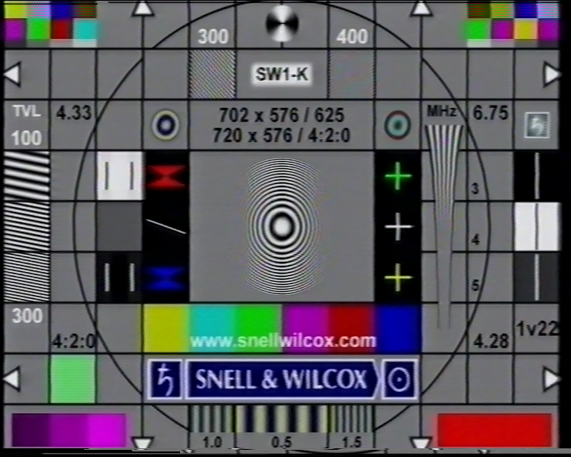
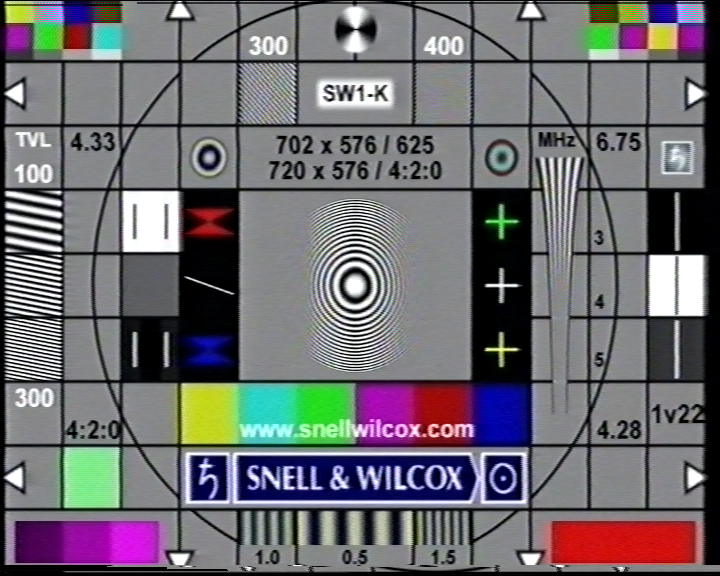

# Phillips VR897/55 picture modes test

### Philips VR897/55 -> Blackmagic Intensity Pro (CVBS)

### TL;DR:

* **NORMAL** - regular picture
* **ENHANCED** - noise reduction, greatly softens the image
* **INCREDIBLE** - added sharpness and brightness. Soft clips white portions, suitable for TV captures or poorly recorded tapes

## NORMAL

## ENHANCED

## INCREDIBLE

