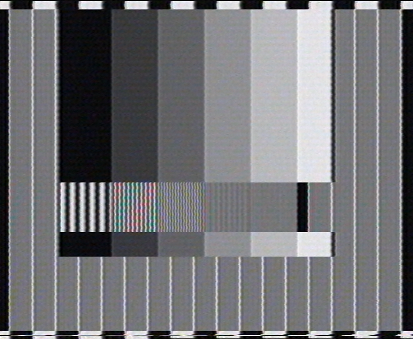

# vhs decode captures of JVC HR-S7700EU

Test tape was recorded with **BM Intensity Pro -> JVC HR-S7700EU (Y/C)** from Davinci Resolve, it contains:
* **SW** - Snell&Wilcox test chart
* **RES+COL** - resolution + color chart
* **RES** - pure B/W resolution test chart

vhs decode setup: **Philips VR355 -> CX card (40MHz crystal) at 8bit/20Msps**

vhs decode configuration:  `--y_comb --use_saved_levels -f 20 -t 6 --tf vhs --no_resample --nld --recheck_phase`

> [!NOTE]
> These are interlaced exported frames from ld-analyse (Transform PAL 2D at 0.01 is used with luma NR disabled)

### SW

### RES+COL

### RES

