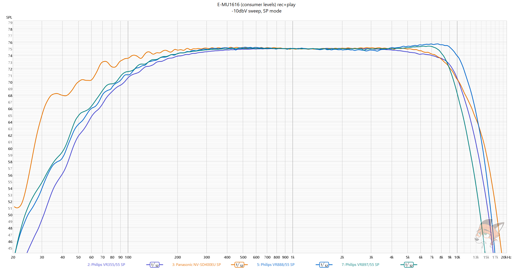

# Frequency response comparison of VHS linear audio in SP/LP modes

> [!NOTE]
> A REW test sweep was recorded on TDK HD-X PRO tape at
> -10dbV on E-MU1616 (consumer levels) and played back later.
> All numbers in charts are somewhat rounded to nearest for ease of reading

## SP mode FR comparison chart

| Manufacturer | Model                                        | Frequency response (-10dB) | Frequency response (-20dB) |
|--------------|----------------------------------------------|----------------------------|----------------------------|
| Panasonic    | **[SD400EU](../Panasonic_NV-SD400EU/README.md)** | **30-13000**                   | **25-16000**                   |
| Phillips     | [VR897/55](../Philips_VR897-55/README.md)    | 50-11000                   | 30-13000                   |
|              | [VR888/55](../Philips_VR888-55/README.md)    | 55-13000                   | 30-15000                   |
|              | [VR355/55](../Philips_VR355-55/README.md)    | 60-12000                   | 40-13500                   |

## LP mode FR comparison chart

| Manufacturer | Model                                        | Frequency response (-10dB) | Frequency response (-20dB) |
|--------------|----------------------------------------------|----------------------------|----------------------------|
| Panasonic    | [SD400EU](../Panasonic_NV-SD400EU/README.md) | 30-6500                    | 20-7500                    |
| Phillips     | [VR897/55](../Philips_VR897-55/README.md)    | 50-6000                    | 30-7500                    |
|              | **[VR888/55](../Philips_VR888-55/README.md)**    | **50-7500**                    | **30-9000**                    |
|              | [VR355/55](../Philips_VR355-55/README.md)    | 50-6500                    | 30-8000                    |

## SP mode FR graphs

## LP mode FR graphs

