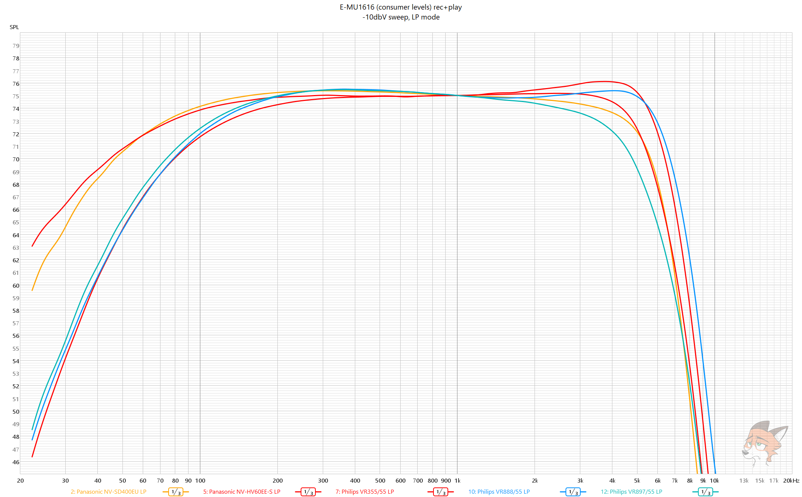
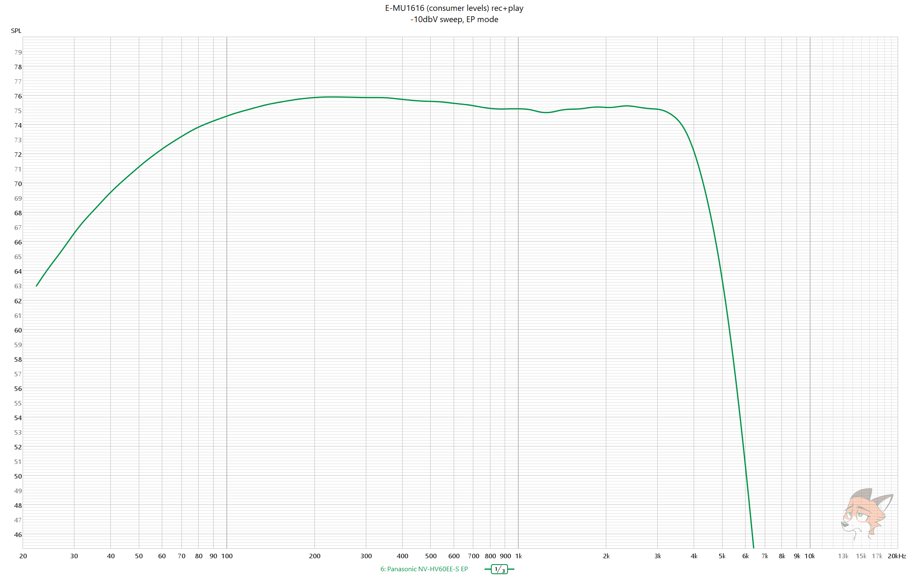
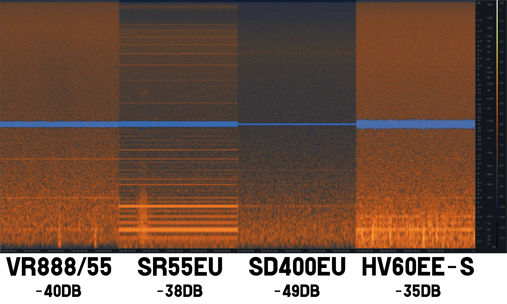
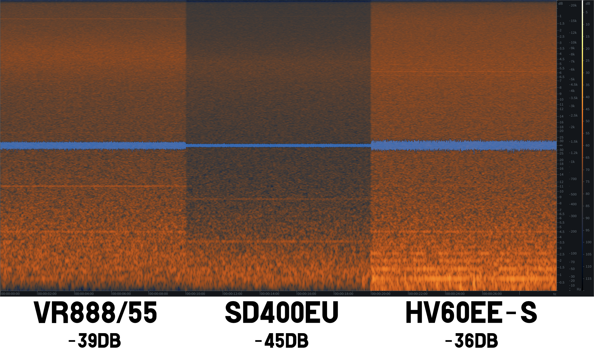

# Frequency response comparison of VHS linear audio in SP/LP/EP modes

> [!NOTE]
> A REW test sweep was recorded on TDK HD-X PRO tape at
> -10dbV (316mVrms) on E-MU1616 (consumer levels) and played back later.
> All numbers in charts are somewhat rounded to nearest (5Hz for LF and 500Hz for HF) for ease of reading. 1/3 oct smoothing was used

## SP mode FR comparison chart

| Manufacturer | Model                                            | Frequency response (-10dB) | Frequency response (-20dB) |
|--------------|--------------------------------------------------|----------------------------|----------------------------|
| Panasonic    | **[SD400EU](../Panasonic_NV-SD400EU/README.md)** | **30-13000**               | **25-16000**               |
|              | [HV60EE-S](../Panasonic_NV-HV60EE-S/README.md)   | 25-11500                   | 20-13500                   |
|              | [SR55EU](../Panasonic_NV-SR55EU/README.md)       | 40-8500                    | 20-10500                   |
| Phillips     | [VR888/55](../Philips_VR888-55/README.md)        | 55-13000                   | 30-15000                   |
|              | [VR897/55](../Philips_VR897-55/README.md)        | 50-11000                   | 30-13000                   |
|              | [VR355/55](../Philips_VR355-55/README.md)        | 60-12000                   | 40-13500                   |

## SP mode FR graphs

## LP mode FR comparison chart

| Manufacturer | Model                                          | Frequency response (-10dB) | Frequency response (-20dB) |
|--------------|------------------------------------------------|----------------------------|----------------------------|
| Panasonic    | [HV60EE-S](../Panasonic_NV-HV60EE-S/README.md) | 25-7200                    | 20-8500                    |
|              | [SD400EU](../Panasonic_NV-SD400EU/README.md)   | 30-6500                    | 20-7500                    |
| Phillips     | **[VR888/55](../Philips_VR888-55/README.md)**  | **50-7500**                | **30-9000**                |
|              | [VR897/55](../Philips_VR897-55/README.md)      | 50-6000                    | 30-7500                    |
|              | [VR355/55](../Philips_VR355-55/README.md)      | 50-6500                    | 30-8000                    |

## LP mode FR graphs

# EP mode FR comparison chart

| Manufacturer | Model                                          | Frequency response (-10dB) | Frequency response (-20dB) |
|--------------|------------------------------------------------|----------------------------|----------------------------|
| Panasonic    | [HV60EE-S](../Panasonic_NV-HV60EE-S/README.md) | 25-4800                    | 20-5500                    |

## EP mode FR graphs

# Equivalent noise level comparison of VHS linear audio in SP/LP/EP modes

> [!IMPORTANT]
> What's an equivalent noise?
> In this case equivalent noise means a **total RMS level** of noise components
> @44.1kHz sampling rate **after normalizing** sweep recording to -1dB sample peak
> 
> \* denotes that interference is present on the recording

## SP mode equivalent noise comparison chart
| Manufacturer | Model                                            | Noise level (dB) |
|--------------|--------------------------------------------------|------------------|
| Panasonic    | **[SD400EU](../Panasonic_NV-SD400EU/README.md)** | **-49**          |      
|              | [SR55EU](../Panasonic_NV-SR55EU/README.md)       | -38*             |
|              | [HV60EE-S](../Panasonic_NV-HV60EE-S/README.md)   | -35              |            
| Phillips     | [VR888/55](../Philips_VR888-55/README.md)        | -40              |            

## SP mode noise spectrum

## LP mode equivalent noise comparison chart

| Manufacturer | Model                                            | Noise level (dB) | 
|--------------|--------------------------------------------------|------------------|
| Panasonic    | **[SD400EU](../Panasonic_NV-SD400EU/README.md)** | **-45**          | 
|              | [HV60EE-S](../Panasonic_NV-HV60EE-S/README.md)   | -36*             |                     
| Phillips     | [VR888/55](../Philips_VR888-55/README.md)        | -39              |               

## LP mode noise spectrum

# EP mode equivalent noise comparison chart

| Manufacturer | Model                                          | Noise level (dB) | 
|--------------|------------------------------------------------|------------------|
| Panasonic    | [HV60EE-S](../Panasonic_NV-HV60EE-S/README.md) | -34              |

## EP mode noise spectrum

Too little data to compare